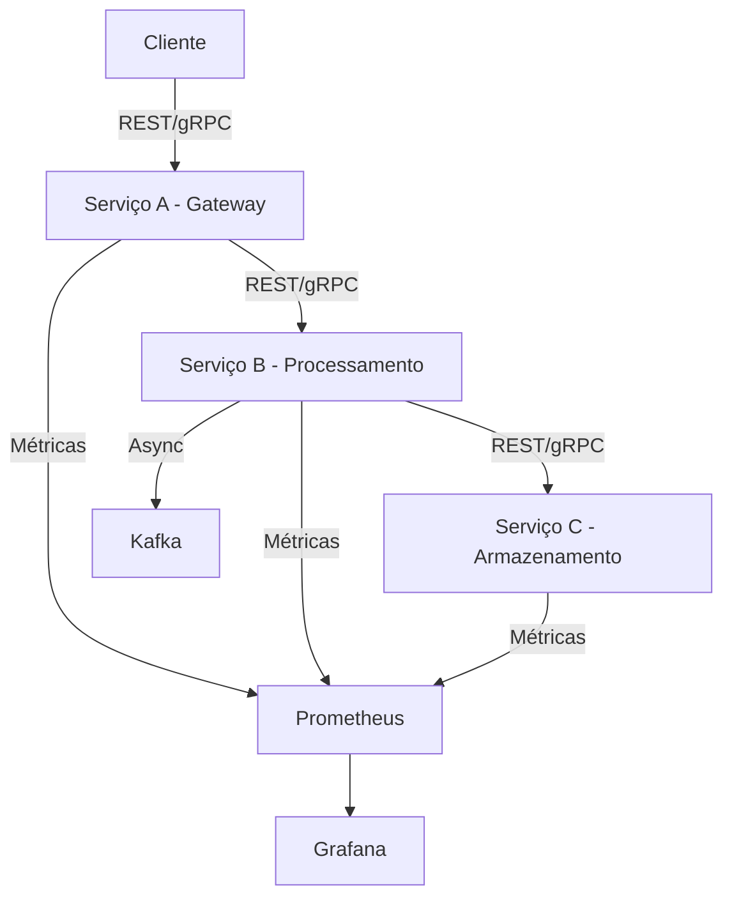

# Arquitetura e Funcionamento dos Serviços

## 1. Visão Geral da Arquitetura



## 2. Detalhamento dos Serviços

### 2.1 Serviço A (Gateway - Node.js)

**Função**: Atua como ponto de entrada para todas as requisições externas.

**Tecnologias**:
- Express.js para API REST (porta 3000)
- @grpc/grpc-js para gRPC (porta 50051)
- Winston para logging
- Prometheus para métricas

**Endpoints**:
1. REST:
   ```
   POST /api/process
   GET /health
   GET /metrics
   ```

2. gRPC:
   ```protobuf
   service ProcessingService {
     rpc ProcessData (ProcessRequest) returns (ProcessResponse);
   }
   ```

**Fluxo de Dados**:
1. Recebe requisições do cliente (REST ou gRPC)
2. Valida os dados de entrada
3. Encaminha para o Serviço B
4. Coleta métricas de latência e throughput
5. Retorna resposta ao cliente

### 2.2 Serviço B (Processamento - Python)

**Função**: Responsável pela lógica de negócio e processamento dos dados.

**Tecnologias**:
- FastAPI para REST (porta 3001)
- grpcio para gRPC (porta 50052)
- structlog para logging
- prometheus_client para métricas

**Características**:
- Escalável horizontalmente (2, 4, 8 instâncias)
- Processamento simulado com delay controlado
- Circuit breaker implementado com Resilience4j

**Fluxo de Processamento**:
1. Recebe dados do Serviço A
2. Aplica regras de negócio (simuladas)
3. Registra métricas de processamento
4. Envia resultado para Serviço C
5. Publica eventos no Kafka (processamento assíncrono)

### 2.3 Serviço C (Armazenamento - Node.js)

**Função**: Responsável pelo armazenamento persistente dos dados processados.

**Tecnologias**:
- Express.js para REST (porta 3002)
- @grpc/grpc-js para gRPC (porta 50053)
- SQLite para armazenamento
- Winston para logging

**Operações**:
1. Armazenamento de Dados:
   - Persiste em SQLite (em memória para testes)
   - Gera ID único por transação
   - Registra timestamp de processamento

2. Consulta de Dados:
   - Busca por ID
   - Listagem com paginação
   - Filtros por timestamp

## 3. Comunicação entre Serviços

### 3.1 REST (HTTP/JSON)

**Formato de Requisição**:
```json
{
  "field1": "string",
  "field2": "string",
  "field3": 123,
  "field4": true,
  "field5": ["array"],
  "field6": {"nested": "object"},
  "field7": "2025-09-07T00:00:00Z",
  "field8": 456.78,
  "field9": "string",
  "field10": "string"
}
```

**Formato de Resposta**:
```json
{
  "message": "string",
  "success": true,
  "processedId": "uuid",
  "timestamp": 1694044800
}
```

### 3.2 gRPC (HTTP/2 + Protocol Buffers)

**Definição do Serviço**:
```protobuf
message ProcessRequest {
  string field1 = 1;
  string field2 = 2;
  int32 field3 = 3;
  bool field4 = 4;
  repeated string field5 = 5;
  map<string, string> field6 = 6;
  string field7 = 7;
  double field8 = 8;
  string field9 = 9;
  string field10 = 10;
}

message ProcessResponse {
  string message = 1;
  bool success = 2;
  string processedId = 3;
  int64 timestamp = 4;
}
```

## 4. Monitoramento e Observabilidade

### 4.1 Métricas Coletadas

1. **Latência**:
   - Tempo de resposta por endpoint
   - Percentis 95 e 99
   - Latência entre serviços

2. **Throughput**:
   - Requisições por segundo
   - Bytes transferidos
   - Taxa de erro

3. **Recursos**:
   - Uso de CPU por serviço
   - Consumo de memória
   - Conexões ativas

### 4.2 Dashboards Grafana

1. **Overview**:
   - Status dos serviços
   - Métricas principais
   - Alertas ativos

2. **Performance**:
   - Gráficos de latência
   - Throughput por serviço
   - Comparativo REST vs gRPC

3. **Recursos**:
   - Uso de CPU/memória
   - Network I/O
   - Disco I/O

## 5. Testes e Validação

### 5.1 Testes de Carga

Utilizando k6 para simular:
- 100 usuários por 5 minutos
- 500 usuários por 5 minutos
- 1000 usuários por 5 minutos

### 5.2 Testes de Resiliência

Usando Chaos Engineering para:
- Desligamento de serviços
- Latência de rede
- Erro em respostas
- Circuit breaker

### 5.3 Testes de Escalabilidade

Verificando comportamento com:
- 1 instância do Serviço B
- 2 instâncias do Serviço B
- 4 instâncias do Serviço B
- 8 instâncias do Serviço B
